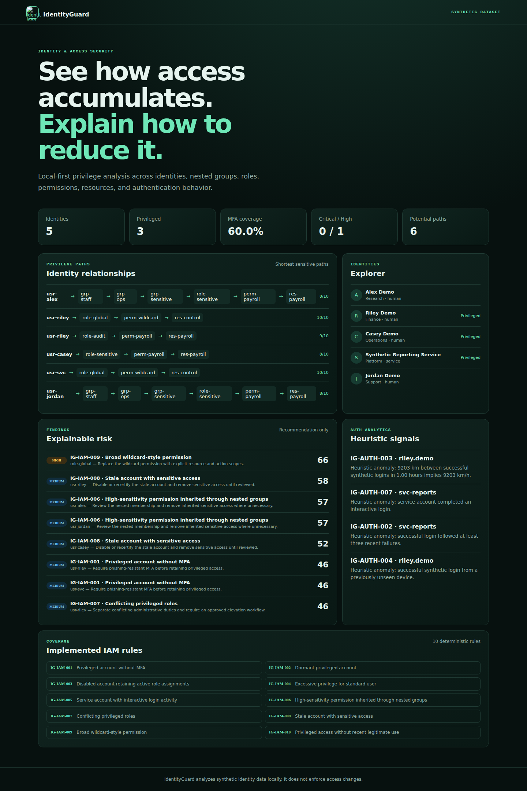
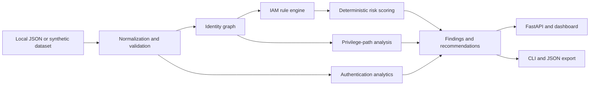

<p align="center">
  
</p>

# IdentityGuard

> Identity and access security analysis platform for privilege risk, identity access paths, and least-privilege remediation.

[](https://github.com/sarahalqaisi/IdentityGuard/actions/workflows/ci.yml)
[](https://www.python.org/)
[](https://fastapi.tiangolo.com/)
[](LICENSE)

## Why this matters

Identity permissions accumulate through direct assignments, nested groups, roles, and broad grants. IdentityGuard makes those relationships explainable: it builds potential access paths, evaluates deterministic defensive rules, analyzes synthetic authentication activity, and recommends least-privilege changes without applying them.

IdentityGuard is a local-first portfolio and lab platform. Its bundled identities, organizations, locations, IP addresses, and login events are synthetic.



## Verified proof points

- Ten stable, deterministic IAM rules with explainable evidence and remediation
- User → Group → Role → Permission → Resource graph with nested-group paths
- Bounded JSON import with duplicate-ID and referential-integrity validation
- Heuristic authentication analytics, including explainable impossible travel
- Read-only API, dashboard, CLI, Docker, and immutable-action CI workflow

## Architecture



## Identity analysis lifecycle

1. Load the deterministic synthetic dataset or a bounded local JSON file.
2. Validate types, unique stable IDs, assignments, and references.
3. Build a directed identity graph and resolve inherited access.
4. Evaluate IAM rules and authentication heuristics.
5. Calculate documented 0–100 risk scores and stable fingerprints.
6. Present evidence and recommendations through the API, UI, or JSON export.

## Main capabilities

- Excessive, dormant, stale, disabled, and conflicting privilege detection
- Missing MFA and interactive service-account checks
- Nested inheritance and wildcard permission analysis
- Potential access paths to high-sensitivity resources
- Failed-login sequences, new-device signals, and impossible-travel heuristics
- Deterministic finding fingerprints and replay deduplication
- Explainable, non-destructive least-privilege recommendations
- ATT&CK references for relevant identity/account behavior

## Example finding

```json
{
  "rule_id": "IG-IAM-001",
  "title": "Privileged account without MFA",
  "risk_score": 46,
  "entity_id": "usr-riley",
  "evidence": {"mfa_enabled": false, "privilege_level": 10},
  "remediation": "Require phishing-resistant MFA before retaining privileged access."
}
```

Risk is an IdentityGuard analytical score, not CVSS. Exact output is derived from the included synthetic dataset.

## Potential access-path example

```text
usr-alex → grp-staff → grp-ops → grp-sensitive
         → role-sensitive → perm-payroll → res-payroll
```

This describes an identity privilege path through current graph relationships. It is not a claim that exploitation was demonstrated.

## Demo

```bash
python3.12 -m venv .venv
source .venv/bin/activate
pip install -e '.[test]'
uvicorn app.main:app --reload
```

Open `http://127.0.0.1:8000`. API documentation is available at `http://127.0.0.1:8000/api/docs`.

## API

| Method | Path | Purpose |
|---|---|---|
| GET | `/api/health` | Service and synthetic-source status |
| GET | `/api/users`, `/api/users/{id}` | Identity explorer data |
| GET | `/api/findings`, `/api/findings/{id}` | Explainable risk findings |
| POST | `/api/analyze` | Analyze demo data or a validated JSON body |
| GET | `/api/attack-paths`, `/api/attack-paths/{user_id}` | Potential access paths |
| GET | `/api/risk/summary` | Identity risk summary |
| GET | `/api/auth-events` | Synthetic events and heuristic anomalies |
| GET | `/api/coverage` | Implemented rule coverage |

## CLI

```bash
python scripts/analyze_identities.py
python scripts/analyze_identities.py --input local-identities.json --json reports/identity-analysis.json
python scripts/analyze_identities.py --fail-on high
```

The CLI does not fail CI by default. `--fail-on` is an explicit policy choice.

## Testing

```bash
pytest
python scripts/validate_demo.py
python -m compileall -q app scripts tests
```

See [validation evidence and commands](docs/VALIDATION.md), the [risk model](docs/RISK_MODEL.md), and the [input format](docs/INPUT_SCHEMA.md).

## Security and privacy

- Synthetic data is required by the current import contract.
- Request bodies and record counts are bounded.
- Client errors are sanitized and sensitive responses use `Cache-Control: no-store`.
- CSP, frame, content-type, and referrer protections are applied globally.
- No CORS policy is enabled and no secrets are required or embedded.
- SQLAlchemy uses parameterized statements; analysis does not execute input as code.

Read [SECURITY.md](SECURITY.md) and [privacy considerations](docs/PRIVACY.md) before adapting the project.

## Limitations

IdentityGuard is not a production IAM replacement and does not integrate with Entra ID, Okta, AWS IAM, or Active Directory. Rules are demonstration policies rather than universal IAM standards. Authentication signals are explainable heuristics, not proof of compromise. The app has no authentication: authentication, RBAC, CSRF protection, rate limiting, privacy review, retention controls, and deployment hardening are required before internet-facing use. Recommendations are never applied automatically.

## License

Apache License 2.0. See [LICENSE](LICENSE).
