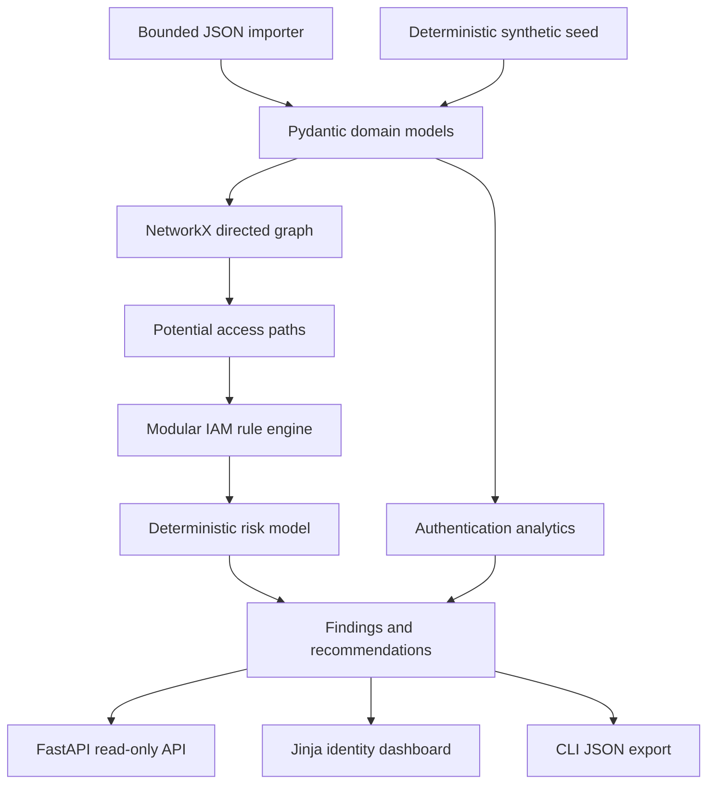

# Architecture

IdentityGuard is a local-first modular monolith. A single typed dataset is passed through independent services; no service performs network calls or executes imported content.

## Trust boundaries

The importer treats local JSON as untrusted. It enforces byte and record limits, strict schemas, unique identifiers, known references, and an explicit synthetic marker. The analysis layer receives typed data only. API error handlers log internal diagnostics server-side while returning stable, sanitized messages.

The dashboard is server-rendered with autoescaping and a restrictive content security policy. It has no write or remediation action. SQLite support is intentionally small and prepared for deduplicated finding persistence; the demo runtime analyzes data in memory.

## Modules

- `importer.py`: size, structure, and reference validation
- `identity_graph.py`: relationship graph and potential access paths
- `rule_engine.py`: stable IAM checks
- `risk.py`: bounded deterministic score
- `auth_analytics.py`: explainable login heuristics
- `findings.py`: canonical fingerprints and deduplication
- `recommendations.py`: least-privilege guidance only
- `analyzer.py`: composition facade
